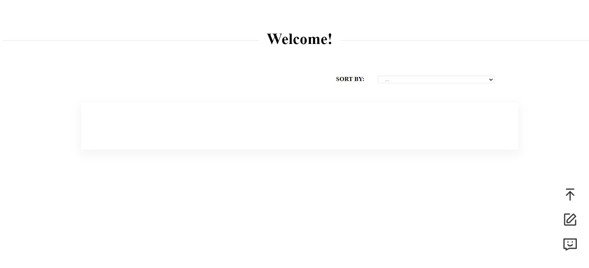
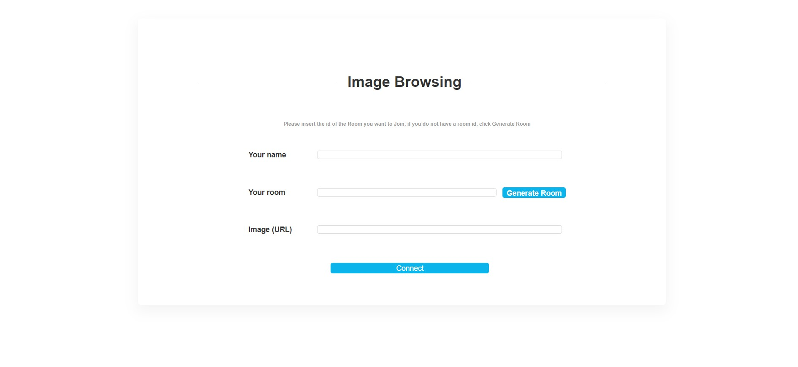
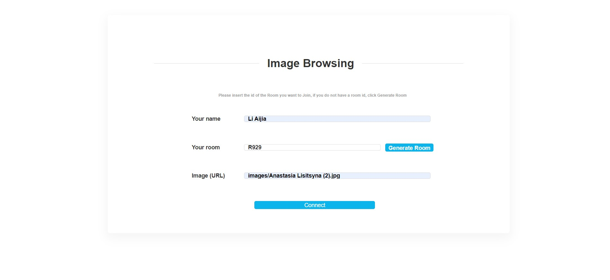
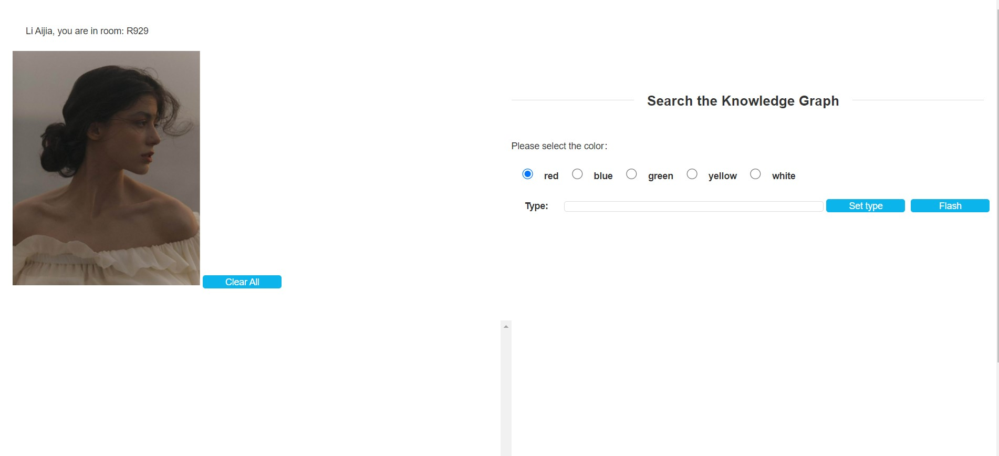
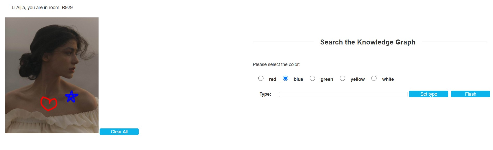
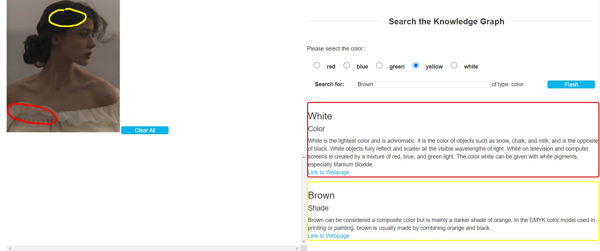
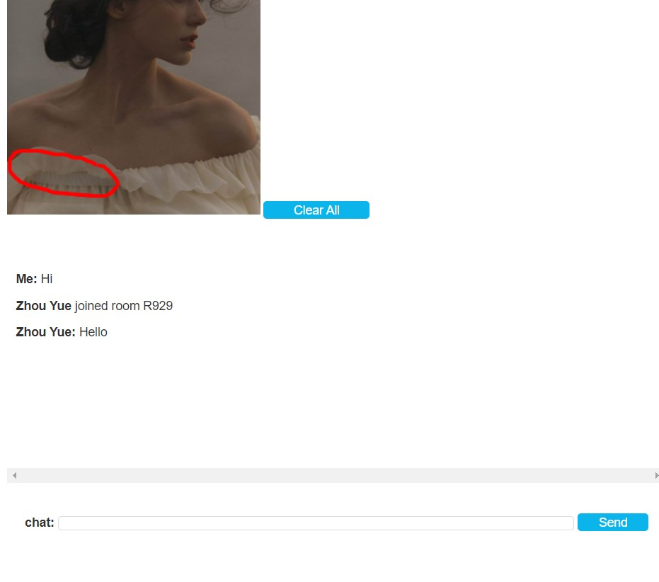

# Zerobug Team
### COM3504/COM6504 Intelligent Web
Assignment 2021-2022

##### Mermbers: Yue Zhou, Aijia Li, Yu Guo

<b>Using the website, the users can create reports, access them and comment on them. </b>

## Before  Use

### Installing MongoDB
We use MongoDB to store all uploaded report information (Including title, author, publication time, short description and photo).

You can download MongoDB on this [webist](https://www.mongodb.com/try/download/community).


When you start your MongoDB and specify the data storage path, we can start the website.
Such as:
```
- mongod -dbpath "Your path"

// Then run MongoDB

- mongo

```

### Open Website
Please run the www file in bin folder.
```
- node www

or

click run button in webstorm
``` 

Open your browser and enter the URL: http://localhost:3000/

When you first open a web page, it looks like this because you don't have any data in your database


When some stories in your MongoDB, you will see them on the screen.

<br>
You can click the three icons in the lower right corner.<br>
<b>Icon Above:</b> Back to top function<br>
<b>Icon Center:</b> Publish your story<br>
<b>Icon Blow:</b> Jump page to create a chat room<br>
<b>sort function:</b> You can choose how you want to sort these stories.<br>

We provide five ways to sort:
> Deafault [ Read in order of data in the database ]
> Author: A to Z
> Author: Z to A
> Time: Early to Now
> Time: Now to Early

<br>

### Upload Story


Complete each information


 
 Click the <b>Submit</b> button to upload your story.

 
 ### Chat Room
 You can click the chat icon to create a chat room 
 or
 You can click any image to create a chat room
 
 

 After filling out the information in the form above, you can enter your chat room




In this chat room, you can choose different colors to mark your picture.


In right section, you can use knowledge graph to search something you want, which can match your image tag color.


In below section, your can message other people in the same chat room.
If someone enter the same room, you will be notified and receive messages from others.


When you exit the room, pass the same name, the same photo and the same room number again, you will still see the picture tag and chat history you left last time.


